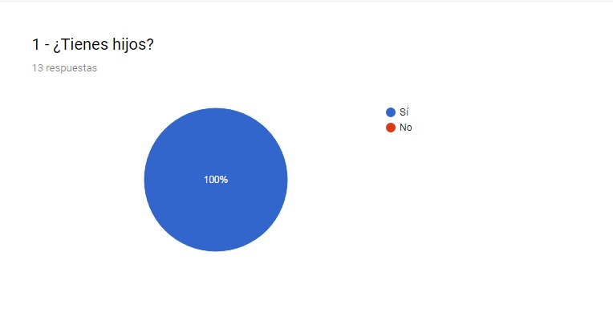
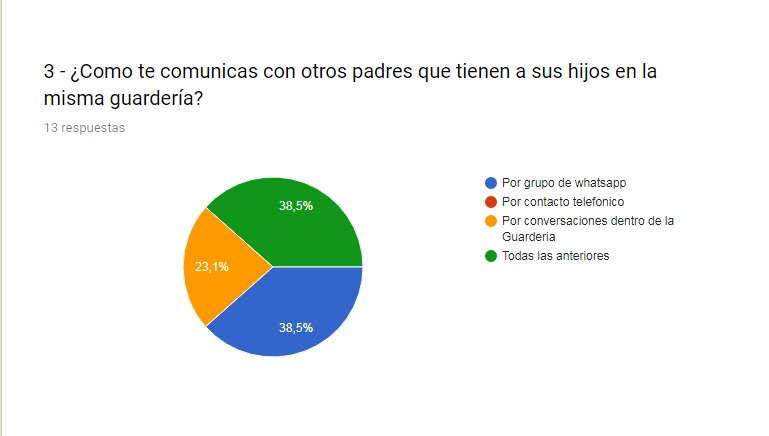
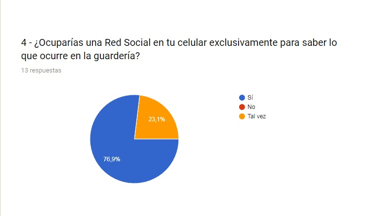
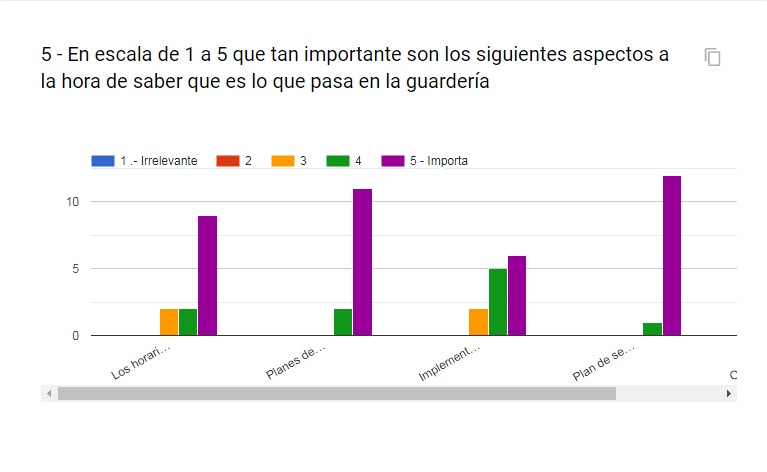
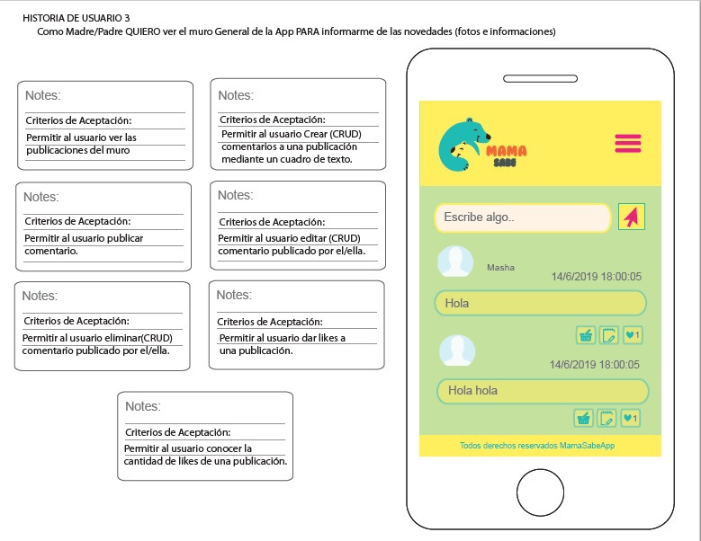

# APLICACIÓN MAMÁ SABE

Mamá Sabe App, es una Red Social para padres (mamis y papis) que tienen hij@s en guarderias y quieren estar todo el timepo informados sobre lo que hacen en estos lugares donde sus hij@s pasan parte de su tiempo, además de estar conectados con las tías que los cuidan y entre ell@s, para intercambiar tips, consejos y cualquier material relevante (informaciones, articulos, fotos, videos y más), pudiendo acceder a ella en cualquier momento desde cualquier dispositivo.

**[VER PÁGINA](https://mariia1304.github.io/SCL009-Social-Network/index.html)**

## **Índice**
* [¿Qué es Mamá Sabe App?](#APLICACIÓN-MAMÁ-SABE)
* [Definición de Mamá Sabe App](#DEFINICIÓN-DEL-PRODUCTO)
* [Proceso de diseño y Planificación de proyecto](#PROCESO-DE-DISEÑO-Y-PLANIFICACIÓN-DEL-PROYECTO)
* [Historias de Usuario y Diseño de Interfaz de Usuario](#HISTORIAS-DE-USUARIO-Y-DISEÑO-DE-INTERFAZ-DE-USUARIO)
* [Test de Usabilidad](#Test-de-Usabilidad)
* [Checklist](#checklist)

# DEFINICIÓN DEL PRODUCTO

Nuestra idea nace de observar la cantidad de grupos (ej.:facebook, whatsapp) de padres/madres que quieren comunicarse con las tias que cuidan a sus hij@s en guarderias y su necesidad de estar informados al respecto. Se realizó una encuesta a algunos padres/madres que tenian hij@s en guarderias, preguntando: Como se comunican y/o obtienen informaciones de las tias y otros padres/madres?, Si se unirian a una red social donde puedan compartir y comunicarse con las tias y otros padres/madres?, Cuan importante seria estar informados de lo que hacen tus hij@s en sus guarderias y poder acceder a esa información en todo momento?, y los resultados de esta arrojaron que mas de un 70% le da valor al estar informados y comunicados en lo que respecta a las guarderias de sus hij@s. Basadas en esto quisimos brindar una herramienta esclusiva para tal fin: Mamá Sabe App!

# PROCESO DE DISEÑO Y PLANIFICACIÓN DEL PROYECTO

**Hicimos una encuesta para poder detectar las necesidades de los usuarios en la relacion a nuestro producto**
****
****
****
****
****
****

**Prototipamos nuestra idea con los siguientes sckeths:**
****
****
****
****
****

A raiz de estas aristas, pudimos definir cada una de las historias de usuario que nos llevan a la construcción de esta App, la cual planificamos de la siguiente forma:
**[LINK: Planificación Red Social](https://trello.com/b/aZR2LZuS/red-social)**.

# HISTORIAS DE USUARIO Y DISEÑO DE INTERFAZ DE USUARIO

### 1) Como Madre/Padre QUIERO Ingresar a la App mediante mi usuario PARA poder ingresar a la App de manera segura.

## Criterios de Aceptación:
- Elegir logearse con cuenta de google o cuenta de app
- Generar mensaje de error si los campos usuario y contraseña estan vacios
- Generar un mensaje de error si al pinchar login el usuario no existe o no coincide la contraseña.

****
**** 

### 2) Como Madre/Padre o Tia QUIERO crear una cuenta en App de Guarderia PARA poder registrarme en la App y ser parte de la comunidad de guarderia.

## Criterios de Aceptación:
- Permitir al usuario rellenar sus datos personales
- Genera mensaje de error si el usuario no ingresa nombre o apellido.
- Genera mensaje de error si el usuario no ingresa un correo valido.
- Genera mensaje de error si el campo contraseña y confirmación no son iguales o esta vacio.
- Validar información al pinchar boton enviar.
- Cuando el usuario crea la cuenta, debe recibir un correo de verificación.
- Despues que el usuario verifique correo se le informará la creación exitosa de su cuenta. 

****
****
****

### 3) Como Madre/Padre QUIERO ver el muro General de la App PARA informarme de las novedades (fotos e informaciones) 
## Criterios de Aceptación:
- Permitir al usuario ver las publicaciones del muro
- Permitir al usuario Crear(CRUD) una publicación mediante un cuadro de texto.
- Permitir al usuario leer (CRUD) publicación.
- Permitir al usuario editar(CRUD) publicación.
- Permitir al usuario eliminar(CRUD) publicación.
- Permitir al usuario dar likes a una publicación.
- Permitir al usuario conocer la cantidad de likes de una publicación.

**** 

## DEFINICIÓN DE TERMINADO QUE DEBEN CUMPLIR CADA UNA DE LAS HISTORIAS DE USUARIO:
- Debe ser una SPA.
- Debe ser responsive.
- Debes haber recibido code review de al menos una compañera de otro equipo.
- Haces test unitarios y, además, has testeado tu producto manualmente.
- Hiciste pruebas de usabilidad e incorporaste el feedback del usuario.
- Desplegaste tu aplicación y has etiquetado tu versión (git tag).

# TEST DE USABILIDAD

En la medida que avanzamos en la construcción de esta app se realizaron algunos test de usabilidad que sirvieron para corregir errores, pueden acceder a algunos de los videos acá:

* [Test HU2](src/assets/img/test-usabilidad-HU2.mp4) 

* [Test HU3](src/assets/img/test-usabilidad-HU3.mp4)

### Consideraciones técnicas Front-end

Este proyecto incluye:

* Estructura basica (HTML5)
* Usa VanillaJS.
* Separación de responsabilidades (Manipulación del DOM de la lógica separada)
* Multiples vistas (Single Page Application SPA) 
* Responsive (CSS3 puro)
* Altera y persiste datos (Firebase)
* Test Unitarios (Jest)

## **Checklist**

* [X] Usa VanillaJS.
* [x] Pasa linter (`npm pretest`)
* [X] Pasa tests (`npm test`)
* [X] Pruebas unitarias cubren un mínimo del 70% de statements, functions y
 lines y branches.
* [X] Incluye _Definición del producto_ clara e informativa en `README.md`.
* [X] Incluye historias de usuario en `README.md`.
* [X] Incluye _sketch_ de la solución (prototipo de baja fidelidad) en
 `README.md`.
* [X] Incluye _Diseño de la Interfaz de Usuario_ (prototipo de alta fidelidad)
 en `README.md`.
* [X] Incluye link a TRELLO en `README.md`.
* [X] Resolución de problemas que detectaste a través de tests de
 usabilidad en el `README.md`.
* [X] Creación de cuenta de usuario e inicio de sesión (Login con Firebase)
* [X] Creacion Muro/Timeline de la Red Social
* [X] Validaciones y Comportamiento
* [X] Cuenta con multiples vistas [Single Page Application (SPA)]
* [X] Sitio Responsive